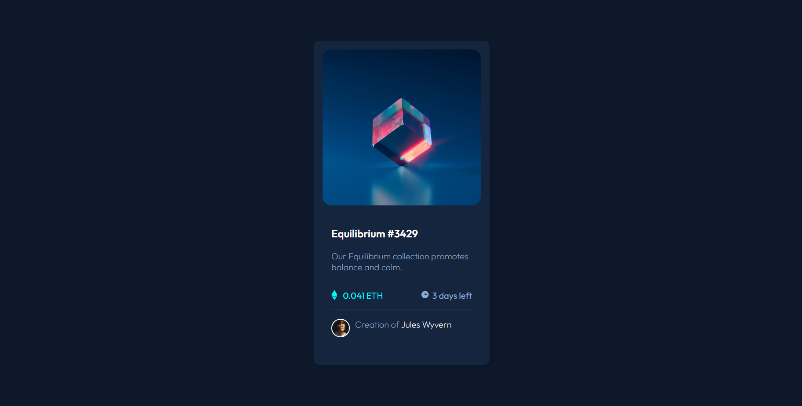

# Frontend Mentor - NFT preview card component solution

This is a solution to the [NFT preview card component](https://www.frontendmentor.io/challenges/nft-preview-card-component-SbdUL_w0U). Frontend Mentor challenges help you improve your coding skills by building realistic projects.

## Table of contents

- [Overview](#overview)
  - [Screenshot](#screenshot)
  - [Links](#links)
- [My process](#my-process)
  - [Built with](#built-with)
  - [What I learned](#what-i-learned)
  - [Useful resources](#useful-resources)
- [Author](#author)

## Overview

The project consists of a single HTML file and a CSS file. The HTML file contains a container div that holds the NFT card and its elements. The CSS file contains styles for the container div, the card, and the text elements.

The NFT card is created using a background image, and is displayed within a div that has a fixed width and height. The text elements are contained within another div, and are styled to have a white background with a blue border.

### Screenshot

### Links

- Solution URL: [Github Repo](https://github.com/nurwandhika/nft-preview-card)
- Live Site URL: [Github Pages](https://your-live-site-url.com)

## My process

1. First, I modified the HTML file to add important components such as the card container and NFT image container.
2. After that, I began working on the CSS. I started by setting the background color and then moved on to the card container.
3. Within the card container, I added the NFT image, NFT title with a hyperlink that changes color when hovered over, and the NFT description.
4. Then, I proceeded to add the price, deadline, and creator sections.

### Built with

- Semantic HTML5 markup
- CSS custom properties
- Flexbox
- Box shadow
- Background Image
- Border radius

### What I learned

1. Using flexbox to position and layout elements:
   The use of flexbox made it easy to position and layout the elements on the page in a responsive manner. The container element .qr-code-container is set to display: flex; and flex-direction: column; to stack the child elements vertically.

2. Styling with CSS:
   CSS is used to style the QR code component with various properties like background-color, padding, box-shadow, border-radius, etc. The properties are used to make the component look visually appealing and user-friendly.

3. Setting a background image with CSS:
   The .qr-code class has a background-image property set to a URL pointing to an image of a QR code. The property is used to display the image as the background of the div.

4. Using media queries for responsive design:
   The viewport meta tag and the @media rule in CSS are used to make the component responsive on different screen sizes. The component adjusts to the width of the viewport, and the text container's max-width is set to 320px to prevent it from overflowing on smaller screens.

5. Creating semantic HTML markup:
   Semantic HTML markup is used to structure the content of the page in a meaningful and understandable way. The head section contains metadata, while the body section contains the page content. The div element is used to group related elements together, and the p element is used to define paragraphs of text.

### Useful resources

- [Dicoding](https://www.dicoding.com/) - This website helped me acquire the fundamentals of web development.
- [Stack Overflow](https://stackoverflow.com/) - This is a common Q&A website for programmers. In this project, I used this website almost everytime I forgot something and needed a quick solution.

## Author

- Website - [Nurwandhika Rachman](https://github.com/nurwandhika)
- Frontend Mentor - [@nurwandhika](https://www.frontendmentor.io/profile/nurwandhika)
- Twitter - [@nurwandhikar](https://www.twitter.com/nurwandhikar)
